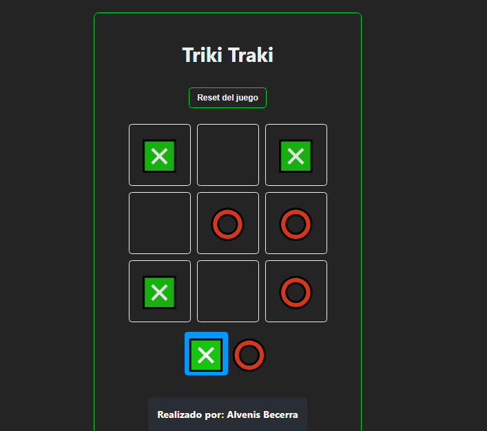
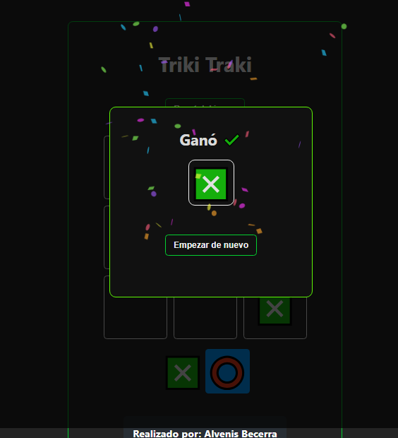
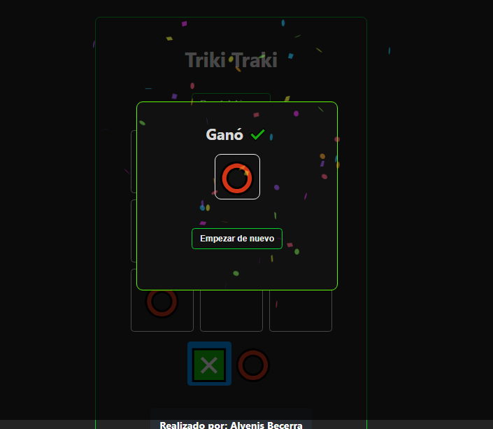

# Proyecto: triki-traki-react


## Descripción del Proyecto

**triki-traki-react** es un proyecto configurado y desarrollado con **Vite** que implementa un juego de filas y columnas similar al juego del triqui o tres en raya. Este juego interactivo permite a los usuarios colocar fichas en un tablero y determina automáticamente cuándo se ha formado una línea ganadora.

### Características

- **Juego Interactivo:** Los usuarios pueden colocar fichas alternativamente en un tablero de juego interactivo.
- **Detección Automática de Ganador:** El juego verifica automáticamente si se ha formado una línea ganadora y muestra el resultado.
- **Componentización:** Implementación utilizando componentes reutilizables y modulares en React.
- **Estilo Personalizado:** Diseño de interfaz utilizando CSS para una apariencia moderna y atractiva.

### Tecnologías Utilizadas

- **Vite:** Herramienta de desarrollo rápida y ligera que facilita la configuración y mejora el tiempo de construcción del proyecto.
- **React:** Biblioteca JavaScript para la construcción de interfaces de usuario.
- **JavaScript y CSS:** Utilizados para la lógica del juego y estilos de diseño respectivamente.

### Capturas de Pantalla





### Instalación

Para instalar y ejecutar este proyecto localmente, sigue estos pasos:

1. Clona este repositorio:
   ```sh
   git clone git@github.com:Alvenisj/triki-traki-react.git
   ```
2. Navega al directorio del proyecto:
   ```sh
   cd triki-traki-react
   ```
3. Instala las dependencias:
   ```sh
   npm install
   ```
4. Inicia el servidor de desarrollo:
   ```sh
   npm run dev
   ```

### Uso

Una vez que el servidor de desarrollo esté en funcionamiento, abre tu navegador y navega a `http://localhost:5173` para ver la interfaz en acción. Puedes interactuar con el botón de seguir para ver la funcionalidad dinámica en tiempo real.

### Contribución

Si deseas contribuir a este proyecto, por favor sigue estos pasos:

1. Haz un fork del proyecto.
2. Crea una nueva rama con tus cambios:
   ```sh
   git checkout -b mi-nueva-rama
   ```
3. Realiza tus modificaciones y haz commit:
   ```sh
   git commit -m 'Descripción de mis cambios'
   ```
4. Empuja tus cambios a la rama:
   ```sh
   git push origin mi-nueva-rama
   ```
5. Abre un Pull Request.

### Licencia

Este proyecto es de código abierto y no tiene una licencia específica. Puedes usar, modificar y distribuir el código según tus necesidades. Sin embargo, ten en cuenta que, sin una licencia explícita, no se ofrecen garantías ni responsabilidades por el uso del código.

---

¡Gracias por visitar este proyecto! Si tienes alguna pregunta o sugerencia, no dudes en contactarme.
